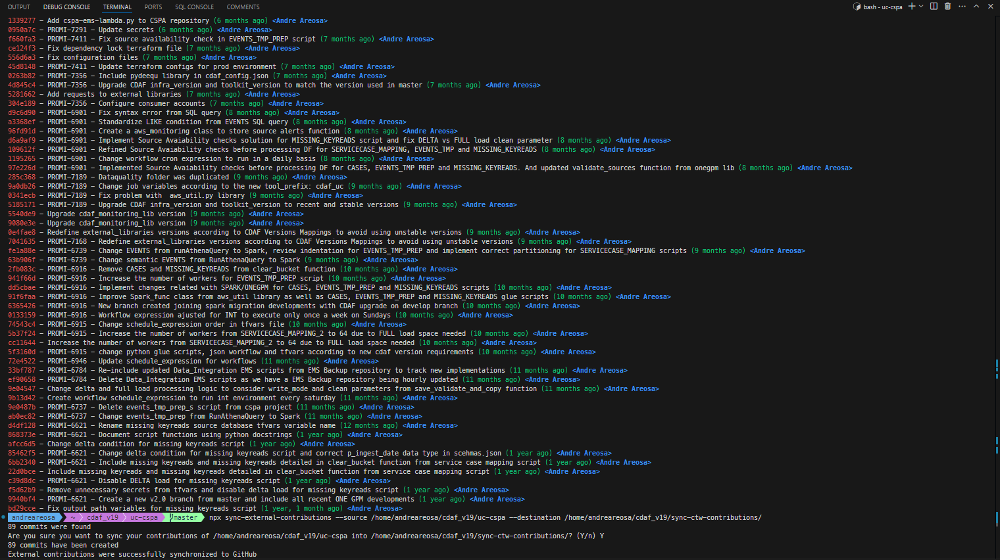
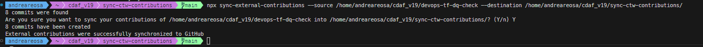

# Sync CTW Contributions

## Overview

This repository, **Sync CTW Contributions**, is designed to retrieve and sync some of contribution history for BMW Critical Techworks. As BMW CTW uses its own instance of GitHub, I am unable to use my personal GitHub account to reflect my contributions accurately. This project retrieves all contributions from my local BMW repositories and generates corresponding GitHub contributions on my personal account.

However, due to certain limitations, the repository names and organization details are not visible. Nevertheless the following screenshots demonstrate the entire flow:




## Acknowledgments

This project uses [sync-external-contributions](https://github.com/charpeni/sync-external-contributions). It uses `git-standup` to read all authored contributions on local repositories and generate GitHub contribution activity for each commit linked to the user.

## Purpose

The script addresses the issue of missing GitHub contributions that may misrepresent my activity while working on projects at BMW CTW. By syncing contributions, I can ensure that my work is properly represented, even when hosted on an external source control system.

## Usage

To use this script, follow these steps:

1. Create a git repository for syncing contributions (e.g., `~/external-contributions`).
2. Initialize the repository and push an initial commit with an empty file named `COMMITS`.
3. Create a corresponding repository on GitHub and set it as the origin.

To sync every commit from your project directory (e.g., `~/some-project`) to the external contributions directory, run:

```bash
npx sync-external-contributions --source ~/some-project --destination ~/external-contributions
```

To sync only specific commits from your project directory (e.g., `~/some-project`) to the external contributions directory, run:

```bash
npx sync-external-contributions --source ~/some-project --destination ~/external-contributions
```

```
Options

  --source string[]      Source repositories to fetch commits
  --destination string   Destination repository to sync contributions into
  --days number          Specify the number of days back to include
  --folder-depth         Specify the number of subfolders to look for repos in source
  --dry-run              Will execute script without syncing
  --force                Force push to the destination (implicit with reset)
  --reset                Reset the destination repository
  --silent               Will not prompt
  -h, --help
```

## License

sync-external-contributions is [MIT Licensed](LICENSE).

## Privacy

The script respects your NDA and privacy by not copying commit content. Instead, it lists all authored commit SHAs and writes them to a file, ensuring a secure process.
